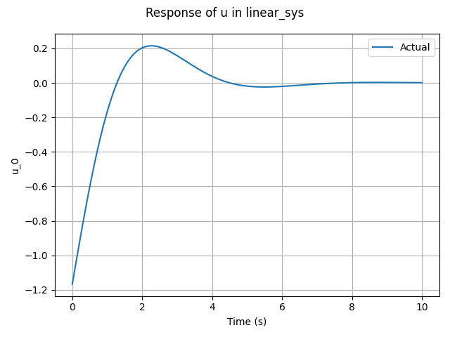

# python-sim-env

`python-sim-env` is a framework for performing numerical simulation of dynamic systems based on python. `python-sim-env` provides several essential components including systems, controllers, and simulators. The motivation of `python-sim-env` can be summarized as

* To make easier to develop code for defining a new dynamic system, controller and simulation model.
* To make it easier to perform a simulation.
* To enhance re-usability of the already developed code.
* To require less computation time for performing a simulation.
* To provide a easy way to utilize simulation data.

`python-sim-env` achieves the goal by:

* Clarifying the role of each component.
* Making sure that each component only contains its essential parts.
* Supporting various types of systems and various ways of writing code.


# Basic Usage

### Example 1: Step response of a linear system

In this example, we will learn the following things.

* Defining a dynamic system.
* Performing a numerical simulation.
* Retrieving the simulation data.

First, let's import modules required for the simulation.

```python
import numpy as np
import matplotlib.pyplot as plt
from pysimenv.core.system import DynSystem
from pysimenv.core.simulator import Simulator
```

We need a `DynSystem` object for defining the linear system and a `Simulator` for performing the simulation.

Consider the standard second-order system defined by a transfer function of
$$
G(s)=\frac{\omega_{n}^{2}}{s^{2} + 2\zeta\omega_{n} + \omega_{n}^{2}}
$$
where $\omega_{n}$ is the natural frequency and $\zeta$ is the damping ratio. The system can be expressed in state-space equation as
$$
\dot{x} = \begin{bmatrix}
0 & 1 \\ -\omega_{n}^{2} & -2\zeta\omega_{n}
\end{bmatrix} x + \begin{bmatrix}
0 \\ \omega_{n}^{2}
\end{bmatrix}u
$$
where $x=[x_{1}\,x_{2}]^{T}$ is the state and $u$ is the control input.

Inside the main function, we define a function named as `deriv_fun` representing the right-hand side of the equation. We use values of $\omega_{n}=1$, $\zeta=0.8$. 

```python
    def deriv_fun(x, u):
        omega = 1.
        zeta = 0.8
        A = np.array([[0, 1.], [-omega**2, -2*zeta*omega]])
        B = np.array([[0.], [omega**2]])
        x_dot = A.dot(x) + B.dot(u)
        return {'x': x_dot}
```

We define a dynamic system object using `DynSystem` class where the initial state is set as $x(0)=[0\,0]^{T}$.

```python
    sys = DynSystem(
        initial_states={'x': np.zeros(2)},
        deriv_fun=deriv_fun
    )
```

Then, we define a simulator and perform a numerical simulation with the integration interval $dt=0.01$, final time $t_{f}=10$, and unit step input for $u$.

```python
    simulator = Simulator(sys)
    simulator.propagate(dt=0.01, time=10., save_history=True, u=np.array([1.]))
```

After the simulation, the time history, state history and input history can be retrieved as

```
    t = sys.history('t')
    x = sys.history('x')
    u = sys.history('u')
```

where the output of `history` method is returned in `numpy.ndarray`. The first axis of each array corresponds to the time index, and the second axis of each array corresponds to the state index. Therefore, we can visualize the simulation data as

```python
    fig, ax = plt.subplots()
    for i in range(2):
        ax.plot(t, x[:, i], label="x_" + str(i + 1))
    ax.set_xlabel("Time (s)")
    ax.set_ylabel("x")
    ax.grid()
    ax.legend()

    fig, ax = plt.subplots()
    ax.plot(t, u)
    ax.set_xlabel("Time (s)")
    ax.set_ylabel("u")
    ax.grid()

    plt.show()
```

The entire code is written as

```python
import numpy as np
import matplotlib.pyplot as plt
from pysimenv.core.system import DynSystem
from pysimenv.core.simulator import Simulator


def main():
    def deriv_fun(x, u):
        omega = 1.
        zeta = 0.8
        A = np.array([[0, 1.], [-omega**2, -2*zeta*omega]])
        B = np.array([[0.], [omega**2]])
        x_dot = A.dot(x) + B.dot(u)
        return {'x': x_dot}

    sys = DynSystem(
        initial_states={'x': np.zeros(2)},
        deriv_fun=deriv_fun
    )
    simulator = Simulator(sys)
    simulator.propagate(dt=0.01, time=10., save_history=True, u=np.array([1.]))

    t = sys.history('t')
    x = sys.history('x')
    u = sys.history('u')

    fig, ax = plt.subplots()
    for i in range(2):
        ax.plot(t, x[:, i], label="x_" + str(i + 1))
    ax.set_xlabel("Time (s)")
    ax.set_ylabel("x")
    ax.grid()
    ax.legend()

    fig, ax = plt.subplots()
    ax.plot(t, u)
    ax.set_xlabel("Time (s)")
    ax.set_ylabel("u")
    ax.grid()

    plt.show()


if __name__ == "__main__":
    main()

```

The following figures show the simulation result.


### Example 2: LQR(Linear  Quadratic Regulator) control of a linear system-Part 1

In this example, we will learn the following things.

* Defining a closed-loop dynamic system.

We begin with importing modules required for the simulation.

```python
import numpy as np
import scipy.linalg as lin
from pysimenv.core.system import DynSystem, MultipleSystem
from pysimenv.core.simulator import Simulator
```

`StaticObject` is used for defining a controller, `DynSystem` for a linear system, `MultipleSystem` for the closed-loop system.

Let us define the structure of the closed-loop system as a class inheriting from `MultipleSystem`.

```python
class ClosedLoopSys(MultipleSystem):
    def __init__(self):
        super(ClosedLoopSys, self).__init__()
```

The open-loop system is defined as

```python
        # open-loop system
        zeta = 0.1
        omega = 1.
        A = np.array([[0., 1.], [-omega**2, -2*zeta*omega]])
        B = np.array([[0.], [omega**2]])

        self.linear_sys = DynSystem(
            initial_states={'x': [0., 1.]},
            deriv_fun=lambda x, u: {'x': A.dot(x) + B.dot(u)}
        )
```

The control gain is calculated as

```python
        # control gain
        Q = np.identity(2)
        R = np.identity(1)
        P = lin.solve_continuous_are(A, B, Q, R)
        self.K = np.linalg.inv(R).dot(B.transpose().dot(P))
```

Every sub simulation object inheriting `SimObject`, which includes `DynSystem` object, must be attached to the super simulation object at the initialization phase. Therefore, we attach `self.linear_sys` as

```python
        self.attach_sim_objects([self.linear_sys])
```

The list of simulation classes inheriting `SimObject` can be found in Overview section.

We define the feedback structure by implementing `_forward` method.

```python
    def _forward(self):
        x = self.linear_sys.state('x')
        u_lqr = -self.K.dot(x)
        self.linear_sys.forward(u=u_lqr)
```

Now, we are ready to perform a simulation. The main function looks like:

```python
def main():
    model = ClosedLoopSys()
    simulator = Simulator(model)
    simulator.propagate(dt=0.01, time=10., save_history=True)
    model.linear_sys.default_plot(show=True)
```

We used `default_plot` method defined in `DynSystem` to simply visualize the simulation result.

The entire code is written as

```python
import numpy as np
import scipy.linalg as lin
from pysimenv.core.system import DynSystem, MultipleSystem
from pysimenv.core.simulator import Simulator


class ClosedLoopSys(MultipleSystem):
    def __init__(self):
        super(ClosedLoopSys, self).__init__()

        # open-loop system
        zeta = 0.1
        omega = 1.
        A = np.array([[0., 1.], [-omega**2, -2*zeta*omega]])
        B = np.array([[0.], [omega**2]])

        self.linear_sys = DynSystem(
            initial_states={'x': [0., 1.]},
            deriv_fun=lambda x, u: {'x': A.dot(x) + B.dot(u)}
        )

        # control gain
        Q = np.identity(2)
        R = np.identity(1)
        P = lin.solve_continuous_are(A, B, Q, R)
        self.K = np.linalg.inv(R).dot(B.transpose().dot(P))

        self.attach_sim_objects([self.linear_sys])

    # implement
    def _forward(self):
        x = self.linear_sys.state('x')
        u_lqr = -self.K.dot(x)
        self.linear_sys.forward(u=u_lqr)


def main():
    model = ClosedLoopSys()
    simulator = Simulator(model)
    simulator.propagate(dt=0.01, time=10., save_history=True)
    model.linear_sys.default_plot(show=True)


if __name__ == "__main__":
    main()

```

The following figures show the simulation result.





### Example 3: LQR(Linear  Quadratic Regulator) control of a linear system-Part 2

In this example, we will learn the following things.

* Defining a controller using `StaticObject`.
* Modifying the sampling interval of the controller.

We begin with importing modules required for the simulation.

```python
import numpy as np
import scipy.linalg as lin
from pysimenv.core.base import StaticObject
from pysimenv.core.system import DynSystem, MultipleSystem
from pysimenv.core.simulator import Simulator
```

We follow the same procedure as in Example 2. The difference is that now we use an object of `StaticObject` class instead of simply defining a control gain.

```python
        # controller
        Q = np.identity(2)
        R = np.identity(1)
        P = lin.solve_continuous_are(A, B, Q, R)
        K = np.linalg.inv(R).dot(B.transpose().dot(P))

        self.lqr_control = StaticObject(interval=0.05, eval_fun=lambda x: -K.dot(x))
```

To illustrate the usefulness of `StaticObject` class, the sampling interval (`interval` property) is intentionally set as 0.2(seconds) corresponding to sampling frequency of 5(Hz).

We attach both the system object and controller object.

```python
        self.attach_sim_objects([self.linear_sys, self.lqr_control])
```

Then, we define the system structure by implementing `_forward` method.

```python
    # implement
    def _forward(self):
        x = self.linear_sys.state('x')
        u_lqr = self.lqr_control.forward(x=x)
        self.linear_sys.forward(u=u_lqr)
```

The rest of the code is similar to that of Example 2. The entire code is written as

```python
import numpy as np
import scipy.linalg as lin
from pysimenv.core.base import StaticObject
from pysimenv.core.system import DynSystem, MultipleSystem
from pysimenv.core.simulator import Simulator


class ClosedLoopSys(MultipleSystem):
    def __init__(self):
        super(ClosedLoopSys, self).__init__()

        # open-loop system
        zeta = 0.1
        omega = 1.
        A = np.array([[0., 1.], [-omega**2, -2*zeta*omega]])
        B = np.array([[0.], [omega**2]])

        self.linear_sys = DynSystem(
            initial_states={'x': [0., 1.]},
            deriv_fun=lambda x, u: {'x': A.dot(x) + B.dot(u)}
        )

        # controller
        Q = np.identity(2)
        R = np.identity(1)
        P = lin.solve_continuous_are(A, B, Q, R)
        K = np.linalg.inv(R).dot(B.transpose().dot(P))

        self.lqr_control = StaticObject(interval=0.2, eval_fun=lambda x: -K.dot(x))

        self.attach_sim_objects([self.linear_sys, self.lqr_control])

    # implement
    def _forward(self):
        x = self.linear_sys.state('x')
        u_lqr = self.lqr_control.forward(x=x)
        self.linear_sys.forward(u=u_lqr)


def main():
    model = ClosedLoopSys()
    simulator = Simulator(model)
    simulator.propagate(dt=0.01, time=10., save_history=True)
    model.linear_sys.default_plot(show=True)


if __name__ == "__main__":
    main()

```

The following figure shows the simulation result.


### Example 4: Cruise control of a vehicle using PI control

In this example, we will learn the following things.

* Defining a controller with internal state.
* Logging history of a variable using a `Logger` object.

The contents of this example is based on K. J. Astrom, 2002, *Control System Design Lecture Notes for ME 155A*, lecture notes, Simple Controllers, University of California.

The purpose of the cruise control is to keep the speed of a car constant. We will define a model for simulating the cruise control of a car moving on the road. The dynamic model is modeled based on a momentum balance. Let $v$ denote the velocity (speed) of the car, $F$ the force generated by the engine, and $\theta$ the slope of the road. The momentum balance can be written as
$$
m\frac{dv}{dt}+cv = F - mg\theta
$$
where $m$ is the mass of the car, $c$ is the coefficient for air resistance, and $g$ is the gravitational acceleration. The equation can be rewritten as
$$
\frac{dv}{dt} = -\frac{c}{m}v + \frac{F}{m} - g\theta \\
$$
Normalize each parameter and variable using the mass as
$$
\frac{dv}{dt} = -\hat{c}v + u - g\theta
$$
Values of parameters are $\hat{c}=0.02$, $g=9.81$. The control signal $u$ is limited to be in the interval $0 \le u \le 1$ and the slope of the road is assumed to be less than 10%, which corresponds to $\theta=0.1$.

The following PI control law will be implemented
$$
u = k_{p}e + k_{i} \int_{0}^{t}e(\tau) \,d\tau
$$
where $e=v_{r} - v$ is the velocity error between the commanded velocity $v_{r}$ and actual velocity $v$.

Import `DynObject` class from `pysimenv.core.system`.

```python
import numpy as np
import matplotlib.pyplot as plt
from pysimenv.core.system import DynObject, DynSystem, MultipleSystem
from pysimenv.core.simulator import Simulator
```

Define a class `PIController` that inherits from `DynObject` class. `PIController` class is defined to have a state named as `e_i` because we need to keep track the integral value of the error. The initial integral value is set as zero.

```python
class PIController(DynObject):
    def __init__(self, k_p, k_i):
        super(PIController, self).__init__(initial_states={'e_i': np.array([0.])})
        self.k_p = k_p
        self.k_i = k_i
```

The `_forward` method of the class is written as

```python
    # implement
    def _forward(self, e):
        self.state_vars['e_i'].set_deriv(deriv=e)

        e_i = self.state('e_i')
        u_pi = self.k_p*e + self.k_i*e_i
        return u_pi
```

Note that `set_deriv` method of the state variable should be called at each time when `_forward` method is called as in the following to properly update the integral value.

```python
        self.state_vars['e_i'].set_deriv(deriv=e)
```


Now define the closed-loop system. The closed-loop system includes the open-loop dynamic model of the car and the PI controller.

```python
class CCCar(MultipleSystem):
    """
    Cruise-controlled car
    """
    def __init__(self, k_p, k_i, v_0):
        super(CCCar, self).__init__()
        # mass-normalized parameters
        c = 0.02
        g = 9.81

        def deriv_fun(v, u, theta):
            v_dot = -c*v + u - g*theta
            return {'v': v_dot}

        self.vel_dyn = DynSystem(
            initial_states={'v': v_0},
            deriv_fun=deriv_fun
        )

        # PI Controller
        self.pi_control = PIController(k_p=k_p, k_i=k_i)

        self.attach_sim_objects([self.vel_dyn, self.pi_control])
```

Implement `_forward` method of the closed-loop system.

```python
    # implement
    def _forward(self, v_r, theta):
        # tracking error
        v = self.vel_dyn.state('v')
        e = v_r - v

        # PI control input
        u_pi = self.pi_control.forward(e=e)
        u = np.clip(u_pi, 0., 1.)

        # update dynamic
        self.vel_dyn.forward(u=u, theta=theta)

        # log velocity error and control signal
        self._logger.append(t=self.time, e=e, u=u)
```

The reference speed `v_r` and the slope of the road `theta` are passed from the outside of the system. The PI control input `u_pi` is clipped to have a value between 0 and 1. A property named as `_logger` is used for logging the history of the time, velocity error, and control signal as in the following.

```python
        # log velocity error and control signal
        self._logger.append(t=self.time, e=e, u=u)
```

`_logger` property is a `Logger` object defined in every object of `SimObject` class. The history of any variable can be logged just by calling `append` method and passing the corresponding key-value as an argument.

To determine the appropriate value for `k_p` and `k_i`, derive the equation for the error dynamics. Assuming that $v_{r}$ is constant and using the relation $e=v_{r}-v$, the error dynamics can be expressed as
$$
\dot{e} + \left(\hat{c} + k_{p} \right)e + k_{i} \int_{0}^{t}e(\tau)\,d\tau=g\theta + \hat{c}v_{r}
$$
The characteristic polynomial of the closed-loop system is
$$
s^{2} + \left(\hat{c} + k_{p} \right)s + k_{i} = 0
$$
Specify the desired response of the closed-loop system by choosing the value of natural frequency $\omega_{0}$ and damping ratio $\zeta$. Then, choose values of  $k_{p}$ and $k_{i}$ as
$$
k_{p} = 2\zeta\omega_{0} - \hat{c},\, k_{i} = \omega_{0}^{2}
$$
We are ready to code the main function. The main function simulates the controller for various values of $\omega_{0}=0.05, 0.1, 0.2$ with $\zeta=1$ and compare the results. The initial velocity and reference velocity of the car is set as 5(m/s). The slope of the road is assumed to suddenly change by 4% from a flat surface. The following code is portion of the main function.

```python
def main():
    zeta = 1.
    omega_0_list = [0.05, 0.1, 0.2]
    v_r = 5.
    theta = 0.04  # 4% slope

    data_list = []

    for omega_0 in omega_0_list:
        k_p = 2*zeta*omega_0 - 0.02
        k_i = omega_0**2

        car = CCCar(k_p=k_p, k_i=k_i, v_0=v_r)
        simulator = Simulator(car)
        simulator.propagate(dt=0.01, time=100, save_history=True, v_r=v_r, theta=theta)

        data = car.history('t', 'e', 'u')  # returns dictionary when the number of variable is greater than 1
        data_list.append(data)
```

After each simulation, the history of the time, velocity error, and control signal is obtained by calling `history` method and passing the corresponding keys as arguments. `history` method returns a dictionary variable when the number of arguments is greater than 1.

```python
        data = car.history('t', 'e', 'u')  # returns dictionary when the number of variable is greater than 1
```

The entire code is written as

```python
import numpy as np
import matplotlib.pyplot as plt
from pysimenv.core.system import DynObject, DynSystem, MultipleSystem
from pysimenv.core.simulator import Simulator


class PIController(DynObject):
    def __init__(self, k_p, k_i):
        super(PIController, self).__init__(initial_states={'e_i': np.array([0.])})
        self.k_p = k_p
        self.k_i = k_i

    # implement
    def _forward(self, e):
        self.state_vars['e_i'].set_deriv(deriv=e)

        e_i = self.state('e_i')
        u_pi = self.k_p*e + self.k_i*e_i
        return u_pi


class CCCar(MultipleSystem):
    """
    Cruise-controlled car
    """
    def __init__(self, k_p, k_i, v_0):
        super(CCCar, self).__init__()
        # mass-normalized parameters
        c = 0.02
        g = 9.81

        def deriv_fun(v, u, theta):
            v_dot = -c*v + u - g*theta
            return {'v': v_dot}

        self.vel_dyn = DynSystem(
            initial_states={'v': v_0},
            deriv_fun=deriv_fun
        )

        # PI Controller
        self.pi_control = PIController(k_p=k_p, k_i=k_i)

        self.attach_sim_objects([self.vel_dyn, self.pi_control])

    # implement
    def _forward(self, v_r, theta):
        # tracking error
        v = self.vel_dyn.state('v')
        e = v_r - v

        # PI control input
        u_pi = self.pi_control.forward(e=e)
        u = np.clip(u_pi, 0., 1.)

        # update dynamic
        self.vel_dyn.forward(u=u, theta=theta)

        # log velocity error and control signal
        self._logger.append(t=self.time, e=e, u=u)


def main():
    zeta = 1.
    omega_0_list = [0.05, 0.1, 0.2]
    v_r = 5.
    theta = 0.04  # 4% slope

    data_list = []

    for omega_0 in omega_0_list:
        k_p = 2*zeta*omega_0 - 0.02
        k_i = omega_0**2

        car = CCCar(k_p=k_p, k_i=k_i, v_0=v_r)
        simulator = Simulator(car)
        simulator.propagate(dt=0.01, time=100, save_history=True, v_r=v_r, theta=theta)

        data = car.history('t', 'e', 'u')  # returns dictionary when the number of variable is greater than 1
        data_list.append(data)

    fig, ax = plt.subplots(2, 1)
    lines = [':', '-', '--']
    for i in range(3):
        data = data_list[i]
        ax[0].plot(data['t'], data['e'], color='b', linestyle=lines[i])
        ax[1].plot(data['t'], data['u'], color='b', linestyle=lines[i])

    ax[0].set_xlabel("Time")
    ax[0].set_ylabel("Velocity error")
    ax[1].set_xlabel("Time")
    ax[1].set_ylabel("Control signal")
    ax[0].set_xticks(np.linspace(0., 100., 11))
    ax[0].set_yticks(np.linspace(0., 4., 5))
    ax[1].set_xticks(np.linspace(0., 100., 11))
    ax[1].set_yticks(np.linspace(0., 0.6, 7))
    fig.tight_layout()
    plt.show()


if __name__ == "__main__":
    main()

```

The following figures show the simulation result.


The dotted line is for the case where $\omega_{0}=0.05$, the full line is for $\omega_{0}=0.1$, and the dashed line is for $\omega_{0}=0.2$.


# Overview

### Important classes and methods

Main components for modeling dynamic systems are summarized in the following diagram. Only the essential attributes and methods are listed in the figure. Mostly used attributes and methods when modeling dynamic systems are expressed in bold font.


System classes inheriting `SimObject` are `StaticObject`, `DynObject`, `DynSystem`, `TimeVaryingDynSystem`, `MultipleSystem`.
