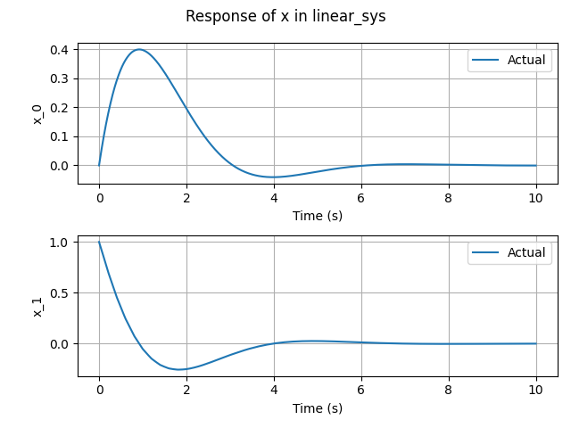

# python-sim-env

`python-sim-env` is a framework for performing numerical simulation of dynamic systems based on python. `python-sim-env` provides several essential components including systems, controllers, and simulators. The motivation of `python-sim-env` can be summarized as

* To make easier to develop code for defining a new dynamic system, controller and simulation model.
* To make it easier to perform a simulation.
* To enhance re-usability of the already developed code.
* To require less computation time for performing a simulation.
* To provide a easy way to utilize simulation data.

`python-sim-env` achieves the goal by:

* Clarifying the role of each component.
* Making sure that each component only contains its essential parts.
* Supporting various types of systems and various ways of writing code.


# Basic Usage

### Example 1: Step response of a linear system

In this example, we will learn the following things.

* Defining a dynamic system.
* Performing a numerical simulation.
* Retrieving the simulation data.

First, let's import modules required for the simulation.

```python
import numpy as np
import matplotlib.pyplot as plt
from pysimenv.core.system import DynSystem
from pysimenv.core.simulator import Simulator
```

We need a `DynSystem` object for defining the linear system and a `Simulator` for performing the simulation.

Consider the standard second-order system defined by a transfer function of
$$
G(s)=\frac{\omega_{n}^{2}}{s^{2} + 2\zeta\omega_{n} + \omega_{n}^{2}}
$$
where $\omega_{n}$ is the natural frequency and $\zeta$ is the damping ratio. The system can be expressed in state-space equation as
$$
\dot{x} = \begin{bmatrix}
0 & 1 \\ -\omega_{n}^{2} & -2\zeta\omega_{n}
\end{bmatrix} x + \begin{bmatrix}
0 \\ \omega_{n}^{2}
\end{bmatrix}u
$$
where $x=[x_{1}\,x_{2}]^{T}$ is the state and $u$ is the control input.

Inside the main function, we define a function named as `deriv_fun` representing the right-hand side of the equation. We use values of $\omega_{n}=1$, $\zeta=0.8$. 

```python
    def deriv_fun(x, u):
        omega = 1.
        zeta = 0.8
        A = np.array([[0, 1.], [-omega**2, -2*zeta*omega]])
        B = np.array([[0.], [omega**2]])
        x_dot = A.dot(x) + B.dot(u)
        return {'x': x_dot}
```

We define a dynamic system object using `DynSystem` class where the initial state is set as $x(0)=[0\,0]^{T}$.

```python
    sys = DynSystem(
        initial_states={'x': np.zeros(2)},
        deriv_fun=deriv_fun
    )
```

Then, we define a simulator and perform a numerical simulation with the integration interval $dt=0.01$, final time $t_{f}=10$, and unit step input for $u$.

```python
    simulator = Simulator(sys)
    simulator.propagate(dt=0.01, time=10., save_history=True, u=np.array([1.]))
```

After the simulation, the time history, state history and input history can be retrieved as

```
    t = sys.history('t')
    x = sys.history('x')
    u = sys.history('u')
```

where the output of `history` method is returned in `numpy.ndarray`. The first axis of each array corresponds to the time index, and the second axis of each array corresponds to the state index. Therefore, we can visualize the simulation data as

```python
    fig, ax = plt.subplots()
    for i in range(2):
        ax.plot(t, x[:, i], label="x_" + str(i + 1))
    ax.set_xlabel("Time (s)")
    ax.set_ylabel("x")
    ax.grid()
    ax.legend()

    fig, ax = plt.subplots()
    ax.plot(t, u)
    ax.set_xlabel("Time (s)")
    ax.set_ylabel("u")
    ax.grid()

    plt.show()
```

The entire code is written as

```python
import numpy as np
import matplotlib.pyplot as plt
from pysimenv.core.system import DynSystem
from pysimenv.core.simulator import Simulator


def main():
    def deriv_fun(x, u):
        omega = 1.
        zeta = 0.8
        A = np.array([[0, 1.], [-omega**2, -2*zeta*omega]])
        B = np.array([[0.], [omega**2]])
        x_dot = A.dot(x) + B.dot(u)
        return {'x': x_dot}

    sys = DynSystem(
        initial_states={'x': np.zeros(2)},
        deriv_fun=deriv_fun
    )
    simulator = Simulator(sys)
    simulator.propagate(dt=0.01, time=10., save_history=True, u=np.array([1.]))

    t = sys.history('t')
    x = sys.history('x')
    u = sys.history('u')

    fig, ax = plt.subplots()
    for i in range(2):
        ax.plot(t, x[:, i], label="x_" + str(i + 1))
    ax.set_xlabel("Time (s)")
    ax.set_ylabel("x")
    ax.grid()
    ax.legend()

    fig, ax = plt.subplots()
    ax.plot(t, u)
    ax.set_xlabel("Time (s)")
    ax.set_ylabel("u")
    ax.grid()

    plt.show()


if __name__ == "__main__":
    main()

```

The following figures show the simulation result.


### Example 2: LQR(Linear  Quadratic Regulator) control of a linear system-Part 1

In this example, we will learn the following things.

* Defining a closed-loop dynamic system.

We begin with importing modules required for the simulation.

```python
import numpy as np
import scipy.linalg as lin
from pysimenv.core.system import DynSystem, MultipleSystem
from pysimenv.core.simulator import Simulator
```

`StaticObject` is used for defining a controller, `DynSystem` for a linear system, `MultipleSystem` for the closed-loop system.

Let us define the structure of the closed-loop system as a class inheriting from `MultipleSystem`.

```python
class ClosedLoopSys(MultipleSystem):
    def __init__(self):
        super(ClosedLoopSys, self).__init__()
```

The open-loop system is defined as

```python
        # open-loop system
        zeta = 0.1
        omega = 1.
        A = np.array([[0., 1.], [-omega**2, -2*zeta*omega]])
        B = np.array([[0.], [omega**2]])

        self.linear_sys = DynSystem(
            initial_states={'x': [0., 1.]},
            deriv_fun=lambda x, u: {'x': A.dot(x) + B.dot(u)}
        )
```

The control gain is calculated as

```python
        # control gain
        Q = np.identity(2)
        R = np.identity(1)
        P = lin.solve_continuous_are(A, B, Q, R)
        self.K = np.linalg.inv(R).dot(B.transpose().dot(P))
```

Every sub simulation object inheriting `SimObject`, which includes `DynSystem` object, must be attached to the super simulation object at the initialization phase. Therefore, we attach `self.linear_sys` as

```python
        self.attach_sim_objects([self.linear_sys])
```

The list of simulation classes inheriting `SimObject` can be found in Overview section.

We define the feedback structure by implementing `_forward` method.

```python
    def _forward(self):
        x = self.linear_sys.state['x']
        u_lqr = -self.K.dot(x)
        self.linear_sys.forward(u=u_lqr)
```

Now, we are ready to perform a simulation. The main function looks like:

```python
def main():
    model = ClosedLoopSys()
    simulator = Simulator(model)
    simulator.propagate(dt=0.01, time=10., save_history=True)
    model.linear_sys.default_plot(show=True)
```

We used `default_plot` method defined in `DynSystem` to simply visualize the simulation result.

The entire code is written as

```python
import numpy as np
import scipy.linalg as lin
from pysimenv.core.system import DynSystem, MultipleSystem
from pysimenv.core.simulator import Simulator


class ClosedLoopSys(MultipleSystem):
    def __init__(self):
        super(ClosedLoopSys, self).__init__()

        # open-loop system
        zeta = 0.1
        omega = 1.
        A = np.array([[0., 1.], [-omega**2, -2*zeta*omega]])
        B = np.array([[0.], [omega**2]])

        self.linear_sys = DynSystem(
            initial_states={'x': [0., 1.]},
            deriv_fun=lambda x, u: {'x': A.dot(x) + B.dot(u)}
        )

        # control gain
        Q = np.identity(2)
        R = np.identity(1)
        P = lin.solve_continuous_are(A, B, Q, R)
        self.K = np.linalg.inv(R).dot(B.transpose().dot(P))

        self.attach_sim_objects([self.linear_sys])

    # implement
    def _forward(self):
        x = self.linear_sys.state['x']
        u_lqr = -self.K.dot(x)
        self.linear_sys.forward(u=u_lqr)


def main():
    model = ClosedLoopSys()
    simulator = Simulator(model)
    simulator.propagate(dt=0.01, time=10., save_history=True)
    model.linear_sys.default_plot(show=True)


if __name__ == "__main__":
    main()

```

The following figures show the simulation result.


### Example 3: LQR(Linear  Quadratic Regulator) control of a linear system-Part 2

In this example, we will learn the following things.

* Defining a controller using `StaticObject`.
* Modifying the sampling interval of the controller.

We begin with importing modules required for the simulation.

```python
import numpy as np
import scipy.linalg as lin
from pysimenv.core.base import StaticObject
from pysimenv.core.system import DynSystem, MultipleSystem
from pysimenv.core.simulator import Simulator
```

We follow the same procedure as in Example 2. The difference is that now we use an object of `StaticObject` class instead of simply defining a control gain.

```python
        # controller
        Q = np.identity(2)
        R = np.identity(1)
        P = lin.solve_continuous_are(A, B, Q, R)
        K = np.linalg.inv(R).dot(B.transpose().dot(P))

        self.lqr_control = StaticObject(interval=0.05, eval_fun=lambda x: -K.dot(x))
```

To illustrate the usefulness of `StaticObject` class, the sampling interval (`interval` property) is intentionally set as 0.2(seconds) corresponding to sampling frequency of 5(Hz).

We attach both the system object and controller object.

```python
        self.attach_sim_objects([self.linear_sys, self.lqr_control])
```

Then, we define the system structure by implementing `_forward` method.

```python
    # implement
    def _forward(self):
        x = self.linear_sys.state['x']
        u_lqr = self.lqr_control.forward(x=x)
        self.linear_sys.forward(u=u_lqr)
```

The rest of the code is similar to that of Example 2. The entire code is written as

```python
import numpy as np
import scipy.linalg as lin
from pysimenv.core.base import StaticObject
from pysimenv.core.system import DynSystem, MultipleSystem
from pysimenv.core.simulator import Simulator


class ClosedLoopSys(MultipleSystem):
    def __init__(self):
        super(ClosedLoopSys, self).__init__()

        # open-loop system
        zeta = 0.1
        omega = 1.
        A = np.array([[0., 1.], [-omega**2, -2*zeta*omega]])
        B = np.array([[0.], [omega**2]])

        self.linear_sys = DynSystem(
            initial_states={'x': [0., 1.]},
            deriv_fun=lambda x, u: {'x': A.dot(x) + B.dot(u)}
        )

        # controller
        Q = np.identity(2)
        R = np.identity(1)
        P = lin.solve_continuous_are(A, B, Q, R)
        K = np.linalg.inv(R).dot(B.transpose().dot(P))

        self.lqr_control = StaticObject(interval=0.2, eval_fun=lambda x: -K.dot(x))

        self.attach_sim_objects([self.linear_sys, self.lqr_control])

    # implement
    def _forward(self):
        x = self.linear_sys.state['x']
        u_lqr = self.lqr_control.forward(x=x)
        self.linear_sys.forward(u=u_lqr)


def main():
    model = ClosedLoopSys()
    simulator = Simulator(model)
    simulator.propagate(dt=0.01, time=10., save_history=True)
    model.linear_sys.default_plot(show=True)


if __name__ == "__main__":
    main()

```

The following figure shows the simulation result.




# Overview

### Important classes and methods

Main components for modeling dynamic systems are summarized in the following diagram. Only the essential attributes and methods are listed in the figure. Mostly used attributes and methods when modeling dynamic systems are expressed in bold font.


System classes inheriting `SimObject` are `StaticObject`, `DynObject`, `DynSystem`, `TimeVaryingDynSystem`, `MultipleSystem`.
